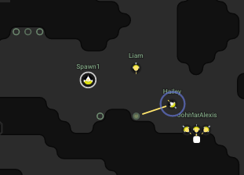

# Nim-Screeps

A module for writing [Screeps](http://screeps.com/) programs with the [Nim](http://nim-lang.org/) programming language!

*MIT License - Copyright 2016 Hans Raaf*

> Why Nim? Because I can!

## What is Screeps?

> [Screeps](https://screeps.com/) - The world's first MMO strategy sandbox game for programmers

In [Screeps](https://screeps.com/) you basically need to write a game AI such that you can sustain control over land in a virtual world. The "World" is shared by all players which fight over land control.



If that sounds vaguely interesting to you go and try the free website based [live demo](https://screeps.com/a/#!/sim/) which does not need registration. Following the Tutorial (in JavaScript) is also highly recommended even if you want to use Nim later on.

## What is Nim?

Nim is a statically typed, imperative programming language with major metaprogramming possibilities.

> What [Wikipedia](https://en.wikipedia.org/wiki/Nim_(programming_language) thinks what Nim is!

Nim can be used as a systems programming language and offers different code generator backends.

The primary code generator is C which then gets automatically compiled to native code for your system. Nim compiles very fast and can even cross compile to embedded devices.

What makes Nim special is also that there are a lot other code generator backends: C, CPP, Objective-C, JavaScript. It even has an experimental PHP backend which is used by the folks in my company [METATEXX GmbH](https://github.com/metatexx). We also develop a [Nim based Zend extension Module](https://github.com/metatexx/nimzend).

### What makes Nim viable for Screeps?

Don't fear! Nim is also *very capable* of rapid development and this makes something like **Nim-Screeps** a viable and fun option for Screeps development.

Since some time Nim also has a JavaScript backend. Which means that you can write in the same language but targeting NodeJS, Servers or execution in a Browser.

The native language for Screeps is **JavaScript**.
This **Nim module** use the magic of the Nim compiler and its JavaScript backend so you can write all your Screeps code directly in Nim!

### Compiling Nim *live* to a remote Server!

Since [Screeps hit Steam](http://store.steampowered.com/app/464350) it is trivial to setup a system which deploys Nim generated JavaScript to the Screeps "World" or "Simulator".

This module makes it easy to setup the whole system and even gives you some working examples for the Screeps Simulator!

Linking the compiler generated code into the Screeps application is merely seeing a path (or using a softlink).

### Let's get startet:

*Attention: The module and the documentation is WIP (but fun to try I think!)*

#### Example: sim1

WIP *(just some OSX hints for now)*

First: Install Screeps with steam on OSX

Then add one/some of the examples to the local screeps script folder. For example like this:

```
cd ~
git clone git@github.com:oderwat/nim-screeps.git
cd ~/Library/Application\ Support/screeps/scripts/screep.com
ln -s ~/nim-screeps/deploy/sim1/ som1
```

Compile the example:

```
cd ~/nim-screeps/examples/sim1/
nim build main.nim
```

Select `sim1` from the branches in the Screeps client inside the Simulator (Training Mode).

### Example: world1

`world1` is very experimental and used for testing the Nim module development. Don't expect it to be a good module from design or gameplay perspective.

There will probably more examples soon. Feel free to contribute.

### What else to know?

Later in time the Screeps engine is announce to be public available and local servers are announced too.

*Have fun... thats why I made it!*
